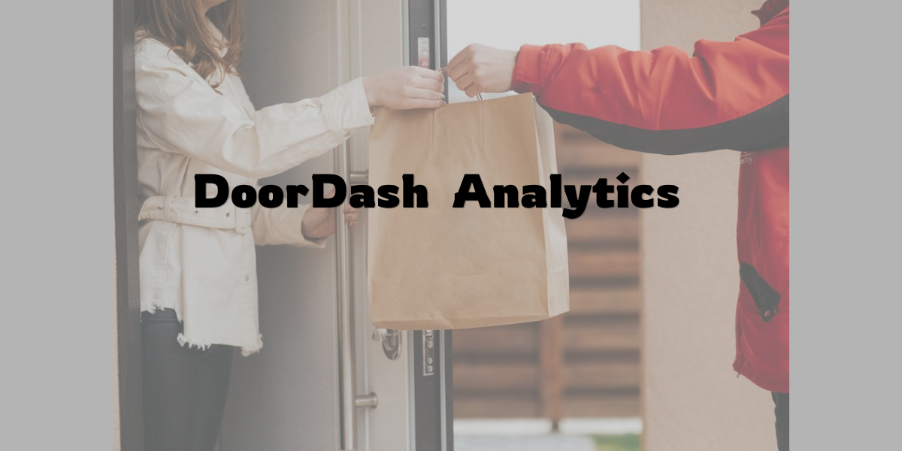
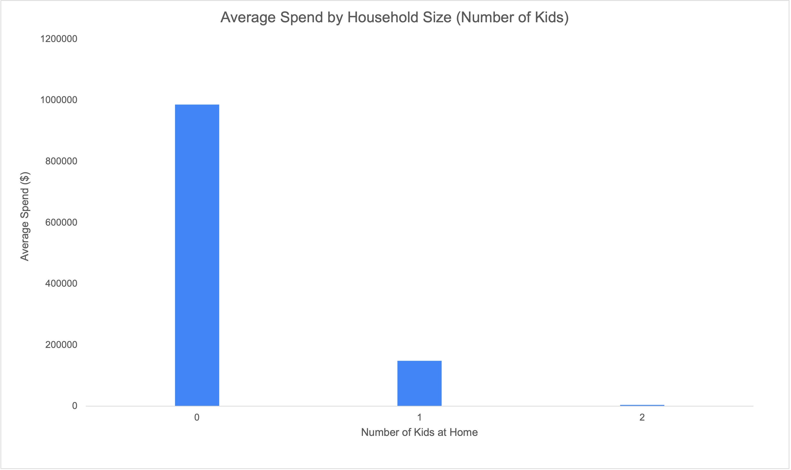
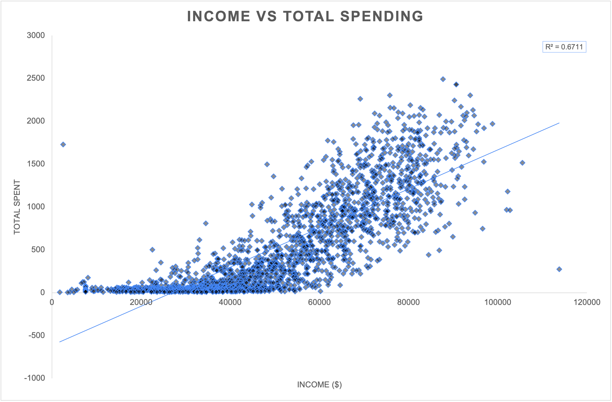
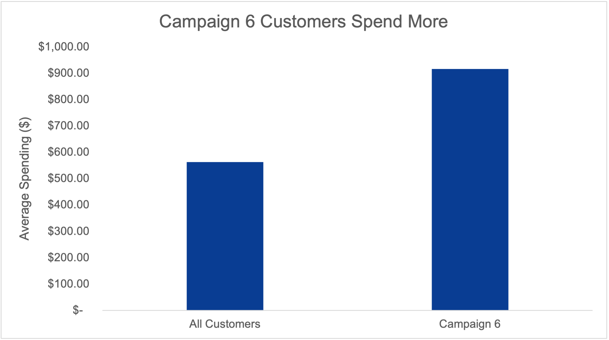

# DoorDash Customer Purchase Behavior Analysis

## 📌 Overview
What drives DoorDash customers to order more and spend more?

The other night, it was late, I was hungry, and like a lot of people, I instinctively opened DoorDash. That made me stop and think what actually drives someone to order more often, spend more money, and keep coming back.

This project analyzes customer purchasing behavior to identify patterns in order frequency, spending habits, and what separates high-value users from the rest.

## Why This Analysis Matters

Understanding customer behavior isn’t just interesting—it directly impacts revenue. 
By identifying what drives users to order more frequently and spend more per order, businesses like DoorDash can optimize promotions, improve retention, and increase overall profitability.

In this analysis, we’ll break down key patterns in customer ordering habits to answer a simple question:
what separates casual users from high-value customers?

## Dataset

This analysis uses a dataset of 2,000+ customer records, with features capturing purchasing behavior such as order frequency, total spending, and engagement across different channels.

## Key Finding #1: Household Structure Impacts Spending

Across all customers, spending drops significantly as the number of kids at home increases. Customers with no kids spend an average of ~$846, compared to ~$183 for those with one child and ~$107 for those with two.

This suggests that household composition may be a major driver of customer spending behavior, with smaller households showing significantly higher average spending levels.

## 2. Higher Income Customers Spend Significantly More

Customer income showed a strong positive relationship with total spending. As income increased, customer spending rose substantially across the dataset.

The scatter plot produced an R² value of ~0.67, suggesting income explains a significant portion of customer spending behavior.

This insight could help businesses better target high-value customer segments and optimize premium marketing campaigns.

## 3. Campaign 6 Customers Spend Significantly More

Customers who accepted Campaign 6 spent substantially more than the average customer.

While the average customer spent approximately ~$564, Campaign 6 responders spent about ~$917 on average — over 60% higher.

This suggests that campaign engagement is strongly associated with higher-value customers and may help identify highly profitable customer segments.

## Key Takeaways

This analysis revealed several strong indicators of high-value customer behavior:

- Customers with fewer children spent significantly more on average
- Higher income strongly correlated with increased customer spending
- Campaign-engaged customers demonstrated substantially higher spending behavior

These findings suggest that demographic factors and marketing engagement can play a major role in customer value segmentation and targeting strategy.

## 🛠 Tools Used
- Excel (Pivot Tables, Charts, Data Cleaning)

